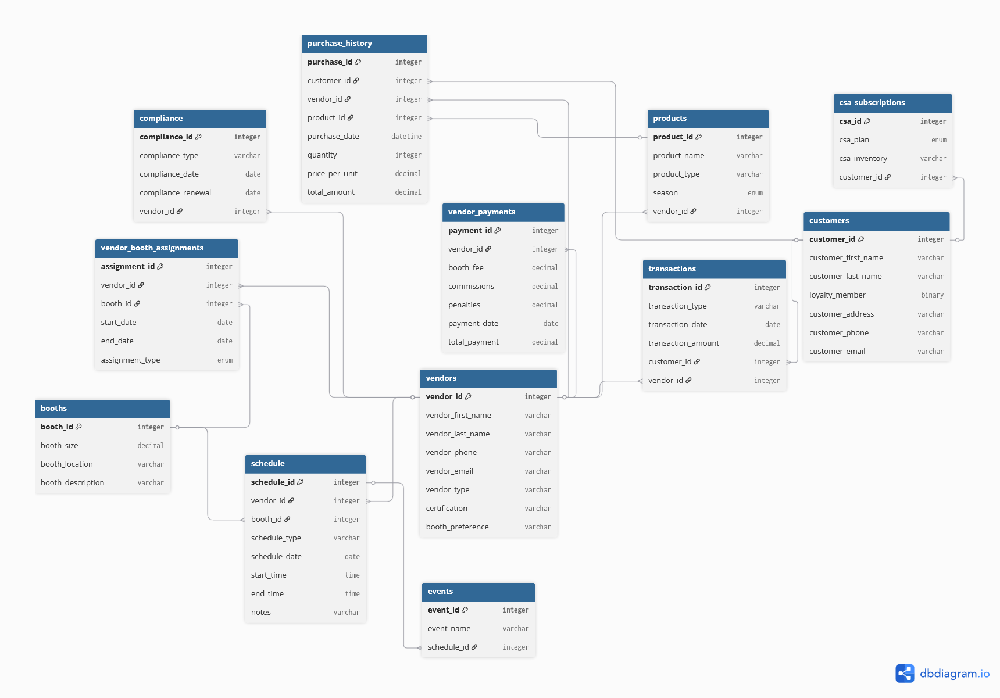

# Town Square Community Market Database

A relational database for managing vendors, booths, products, customers, and compliance at a local farmers market.

---

## Overview

Town Square Community Market is a vendor-based farmers market where farmers, food cooperatives, craftspeople, and artisans sell directly to the community. The market generates revenue through booth rental fees, vendor commissions, and supplementary services.

This database manages the full operation of the market, including vendor vetting and compliance, booth assignments, product tracking, customer loyalty, CSA subscriptions, financial transactions, and event scheduling.

---

## ERD



---

## Database Structure

| Table | Description |
|---|---|
| `vendors` | Vendor contact info, certifications, and booth preferences |
| `customers` | Customer contact info and loyalty membership status |
| `products` | Products offered by vendors, classified by season |
| `booths` | Booth size, location, and description |
| `vendor_booth_assignments` | Tracks which vendors are assigned to which booths and when |
| `purchase_history` | Records of customer purchases from vendors |
| `transactions` | Financial transaction records for customers and vendors |
| `vendor_payments` | Booth fees, commissions, and penalties owed by vendors |
| `schedule` | Market operating hours and vendor schedules |
| `events` | Special events linked to schedule entries |
| `csa_subscriptions` | Customer CSA subscription plans and delivery preferences |
| `compliance` | Vendor health permits, licenses, and insurance records |

---

## Key Features

### Normalization
The database is normalized through third normal form (3NF). Each non-key column depends only on the primary key of its table, eliminating partial and transitive dependencies. For example, booth preference is stored on the `vendors` table rather than the `booths` table because it describes the vendor's preference, not a property of the booth itself.

### Constraints
- **CHECK** constraints enforce positive quantities and unit prices in purchase history, non-negative booth fees and commissions, and valid date/time ranges throughout
- **ENUM** constraints standardize categorical data such as product season (`spring`, `summer`, `fall`, `winter`), booth assignment type (`permanent`, `seasonal`, `temporary`), and CSA plan type (`weekly`, `monthly`, `produce-only`, `dry-goods-only`)
- **UNIQUE** constraints prevent duplicate vendor phone numbers, email addresses, and business names
- **NOT NULL** constraints ensure essential fields like vendor contact details, product names, and compliance dates are always provided

### Stored Procedure
A stored procedure validates booth availability before making new assignments, preventing double-booking conflicts.

### Views
Pre-built views are included for common queries:
- Active CSA subscriptions
- Upcoming compliance renewal dates

### Role-Based User Accounts

| Account | Permissions |
|---|---|
| `tscm_admin` | Full privileges — manage all tables, users, and permissions |
| `tscm_manager` | SELECT, INSERT, UPDATE, DELETE on all tables |
| `tscm_customer_service` | SELECT, INSERT, UPDATE on customers and CSA subscriptions only |
| `tscm_viewer` | SELECT only — read-only access across all tables |

Passwords are not included in this repository.

### Automated Backups
A cronjob performs a full `mysqldump` of the database daily at midnight, naming each backup file with the date it was created and storing it in the `/backups/` directory.

---

## How to Import

```bash
mysql -u your_username -p your_database_name < tscm.sql
```

---

## Tech Stack

- MySQL
- mysqldump
- phpMyAdmin
